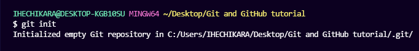

# How to Create and Initialize a Project in Git

We are finally done with installing and setting up Git. It is now time to create our project.

I have created a folder on my desktop called **Git and GitHub tutorial**. Using the command line, navigate to your new project's location. For me, I would run the following commands:

```bash
cd desktop
cd Git and GitHub tutorial
```

If you are new to the command line and are still learning how to use it to navigate around your PC, then I would suggest using Microsoft's Visual Studio Code. It is a code editor which has an inbuilt terminal for executing commands. You can download it [here](https://code.visualstudio.com/download).

After installing VS Code, open your project in the editor and open a new terminal for your project. This automatically points the terminal/command line to your project's path.

Now to initialize your project, simply run `git init`. This will tell Git to get ready to start watching your files for every change that occurs. It looks like this:



Now our project being watched/tracked by Git.

## Git project files

I have created only one file called **todo.txt**. This is what the file looks like:

```cpp
MY TO-DO LIST

1. Write an article.
2. Code.
3. Study books.
4. Attend classes on time.
5. Visit aunt.
6. Apply for remote jobs

```
Before we proceed with learning other Git commands, let's talk about **GitHub**.

# What is Github?

* GitHub is an online hosting service for Git repositories. Imagine working on a project at home and while you are away, maybe at a friend's place, you suddenly remember the solution to a code error that has kept you restless for days.

* You cannot make these changes because your PC is not with you. But if you have your project hosted on GitHub, you can access and download that project with a command on whatever computer you have access to. Then you can make your changes and push the latest version back to GitHub.
* In summary, GitHub lets you store your repo on their platform. Another awesome feature that comes with GitHub is the ability to collaborate with other developers from any location.
* Now that we have created and initialized our project locally, let's push it to GitHub.
* If you are a beginner, you will come across some new terms like push, commit, add, and so on – but do not be overwhelmed by them. With some practice you will be able to remember these terms and what they do.
* 
